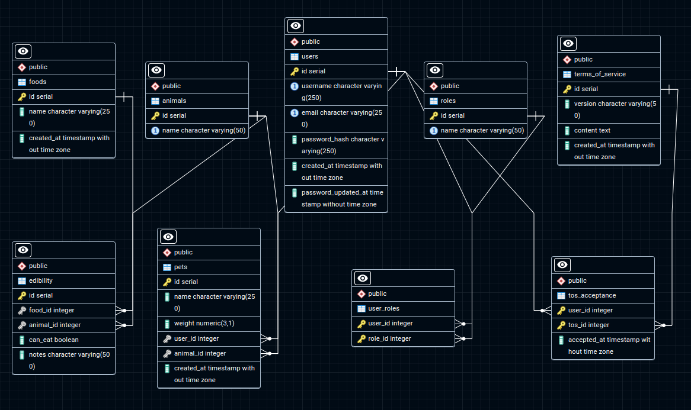

# Can my pet eat this

## Introduction

A backend RESTful API that helps the user know if his pets can eat certain foods. Built with Python, Flask and PostgreSQL.

## Features

- User Authentication:

  - Users can create an account, log in, and log out securely using JWT (JSON Web Tokens) for authentication.

- CRUD Operations for Foods, Pets and Users:

  - Create: Users can add new pets by providing the required fields.
  - Read: Users can view a list of all their pets and which food thay can or cannot eat.
  - Update: Users can edit the information of their pets profiles.
  - Delete: Users can remove their pets.

- User Profiles:
  - Each user has a profile where they can add, update and delete their pets while they can manage their account settings too. API uses three types of users with different access (admins, veterinarians, common users.)

## Technologies Used

- Python
- Flask
- PostgreSQL
- psycopg2-binary
- flask-jwt-extended
- bcrypt
- Flask-Mail

## Installation

1. Clone the repository:
   `https://github.com/nikgiannnjs/can-my-pet-eat-this.git`

2. Navigate to the project directory:
   `cd can-my-pet-eat-this`

3. Install dependencies:
   `pip install -r requirements.txt`

4. Set up PostgreSQL database:

   - Run the queries found in seed.sql file in your PostgreSQL database:
     1. Create a user
     2. Set this user as an admin.
   - (The first user needs to be created in PostgreSQL and be assigned as an admin in order for the API to function, for   access and user roles reasons. Admin assignement query is also in the seed.sql file.)
   - (Table seeds are demo data for the API to function.)

5. Update the dbconnection with your PostgreSQL credentials.

6. Start the application:
   `Flask run`

## Usage

A user creates their profile by providing a first name, last name, email, and password. They can add several pets they own with their information(Pet name, weight and animal species). The user can provide foods and their pets and see if the food is edible based on the pet species. Users are separated in admins, veterinarians and common users. Admins have access in user CRUD operations and db information. Veterinarians have access in the foods and edibility information.

## API Endpoints

### Users Routes

- `POST` `/users/register`\
   Creates a new user and assigns common user role. Requires a JSON body:

  ```json
  {
    "first_name": "first_name",
    "last_name": "last_name",
    "email": "test@gmail.com",
    "password": "user_password",
    "password_confirm": "user_password"
  }
  ```

- `POST` `/users/login`\
  User login. Requires a JSON body:

  ```json
  {
    "first_name": "first_name",
    "last_name": "last_name",
    "email": "test@gmail.com",
    "password": "user_password"
  }
  ```

- `POST` `/users/refresh_token`\
  Refresh access token. Requires a valid refresh jwt token as a Bearer token Authentication header:

- `POST` `/user/change_password/<int:id>`\
  Update user password. Requires a JSON body and a user id as a parameter:

  ```json
  {
    "old_password": "old_password",
    "new_password": "new_password",
    "new_password_confirmation": "new_password"
  }
  ```

- `POST` `/users/forgot_password<int:id>`\
  Provides reset password link via email for setting new password. Requires a JSON body and a user id as a parameter:

  ```json
  {
    "email": "test_email@gmail.com"
  }
  ```

- `POST` `/users/reset_password/<token>`\
  Creates new password. Requires a JSON body and a valid token as a parameter:

  ```json
  {
    "new_password": "new_password",
    "new_password_confirmation": "new_password"
  }
  ```

- `POST` `/users/change_user_name/<int:id>`\
  Updates user's name. Requires a JSON body and a user id as a parameter:

  ```json
  {
    "first_name": "new_first_name",
    "last_name": "new_last_name"
  }
  ```
  
 - `POST` `/users/change_user_email/<int:id>`\
  Updates user's email. Requires a JSON body and a user id as a parameter:

  ```json
  {
    "email": "new_email"
  }
  ```
  
  - `POST` `/users/change_user_name/<int:id>`\
  Updates user's name. Requires a JSON body and a user id as a parameter:

  ```json
  {
    "first_name": "new_first_name",
    "last_name": "new_last_name"
  }
  ```
  
  - `POST` `/users/tos_acceptance/<int:id>`\
  Accepts Terms of Service. Requires a JSON body and a user id as a parameter:

  ```json
  {
    "version": "tos_version ",
    "status": boolean
  }
  ```
  
 - `POST` `/users/assign_role`\
  Assigns user roles. Requires admin access, a JSON body and a valid jwt token as a Bearer token Authentication header:

  ```json
  {
    "user_id": user_id_to_be_assigned_role,
    "role_id": role_id
  }
  ```
  
 - `GET` `/users/get_all_users`\
  Gets all users. Requires admin access and a valid jwt token as a Bearer token Authentication header:
  
 - `DELETE` `/users/delete_user`\
  Deletes a user.Requires admin access, a JSON body and a valid jwt token as a Bearer token Authentication header:

  ```json
  {
    "user_id": user_to_be_deleted_id
  }
  ```
  
### Pet Routes

- `POST` `/my_pets/add_new_pet/<int:id>`\
  Adds new pet. Requires a JSON body, a valid jwt access token as a Bearer token Authentication header and the user id as parameter:

  ```json
  {
    "pet_name": "pet_name",
    "pet_weight": pet_weight,
    "animal_id": animal_id(species)
  }
  ```

- `GET` `/my_pets/all_my_pets/<int:id>`\
  Get all user's pets. Requires a valid jwt access token as a Bearer token Authentication header and the user id as parameter:

- `DELETE` `/my_pets/delete_pet/<int:id>`\
  Deletes pet. Requires a valid jwt access token as a Bearer token Authentication header and the user id as parameter.

- `PATCH` `/my_pets/update_pet_info/<int:id>`\
  Updates pet information. Requires a JSON body, a valid jwt access token as a Bearer token Authentication header and the user id as parameter:

  ```json
  {
    "id": pet_id,
    "pet_name": "pet_name",
    "pet_weight": weight,
    "animal_id": animal_id(species)
  }
  ```

- `GET` `/my_pets/is_edible/<int:id>`\
  Gets edibility combination. Requires a JSON body, a valid jwt access token as a Bearer token Authentication header and the user id as parameter:

  ```json
  {
    "pet_id": pet_id,
    "food_id": food_id
  }
  ```

- `POST` `/my_pets/add_animals`\
  Adds new animals in the db. Requires admin access, a JSON body and a valid jwt access token as a Bearer token Authentication header:

  ```json
  {
    "animal_name": "animal_name"
  }
  ```

- `POST` `/my_pets/update_animals/<int:id>`\
  Updates animal information. Requires admin access, a JSON body and a valid jwt access token as a Bearer token Authentication header and the animal id to update as a parameter:

  ```json
  {
    "new_animal_name": "new_animal_name"
  }
  ```
  
 - `DELETE` `/my_pets/delete_animals/<int:id>`\
  Delete animals from db. Requires admin access, a valid jwt access token as a Bearer token Authentication header and the animal id to delete as a parameter.

### Food Routes

- `POST` `/foods/add_food`\
  Ads new food in db. Requires veterinarian access, a JSON body and a valid jwt access token as a Bearer token Authentication header:

  ```json
  {
    "food_name": "food_name"
  }
  ```

- `POST` `/foods/update_food/<int:id>`\
  Update food information. Requires veterinarian access, a JSON body, a valid jwt access token as a Bearer token Authentication header and the food id as a parameter:

  ```json
  {
    "food_name": "new_food_name"
  }
  ```

- `DELETE` `/foods/delete_food/<int:id>`\
  Deletes food from db. Requires veterinarian access, a valid jwt access token as a Bearer token Authentication header and the food id as a parameter.

- `GET` `/foods/get_all_foods`\
  Gets all foods from db. Requires veterinarian access and a valid jwt access token as a Bearer token Authentication header.

- `GET` `/foods/get_all_edibilities`\
  Gets all edibility combinations in db. Requires veterinarian access and a valid jwt access token as a Bearer token Authentication header:

- `DELETE` `/foods/delete_edibility/<int:id>`\
  Deletes edibility combination from db. Requires veterinarian access, a valid jwt access token as a Bearer token Authentication header and the edibility id as a parameter:

  
- `POST` `/foods/update_edibility/<int:id>`\
  Updates edibility combination information. Requires veterinarian access, a JSON body, a valid jwt access token as a Bearer token Authentication header and the edibility id as a parameter:

  ```json
  {
    "can_eat": boolean,
    "notes": "Demo text."
  }
  ```
  
- `POST` `/foods/add_edibility`\
  Adds new edibility combination in db. Requires veterinarian access, a JSON body and a valid jwt access token as a Bearer token Authentication header:

  ```json
  {
    "food_id": food_id,
    "animal_id": animal_id,
    "can_eat": boolean,
    "notes": "Demo text."
  }
  ```

## Database Schema

#### erDiagram

